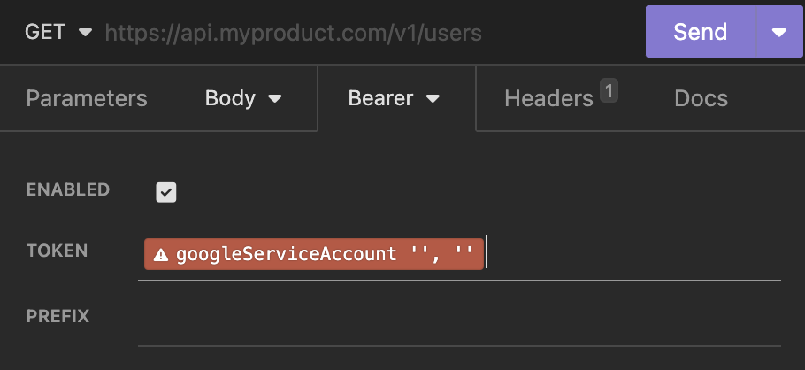

# Insomnia Plugin for Google Authentication Tokens

This is Insomnia plugin creates JWT access tokens for accessing Google APIs using a Service Account.

## Installation
Install the `insomnia-plugin-google-auth` plugin from Preferences > Plugins

## Usage

Add the `Google Service Account` template as your Bearer token.

Edit the tag and provide the full path to your service client's credentials file, as well as the required API scopes.

